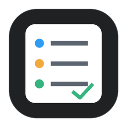
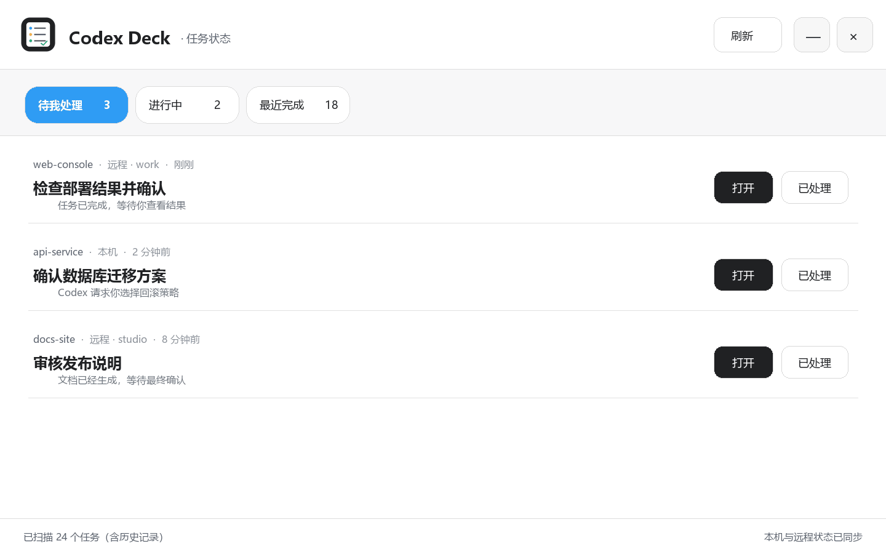
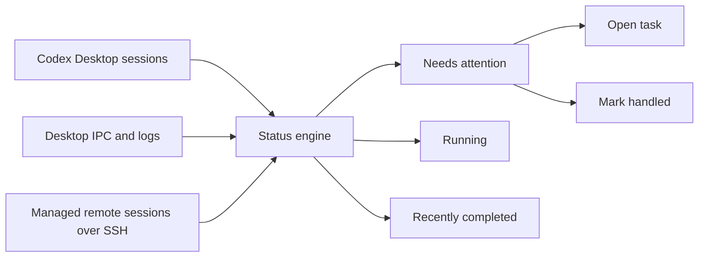
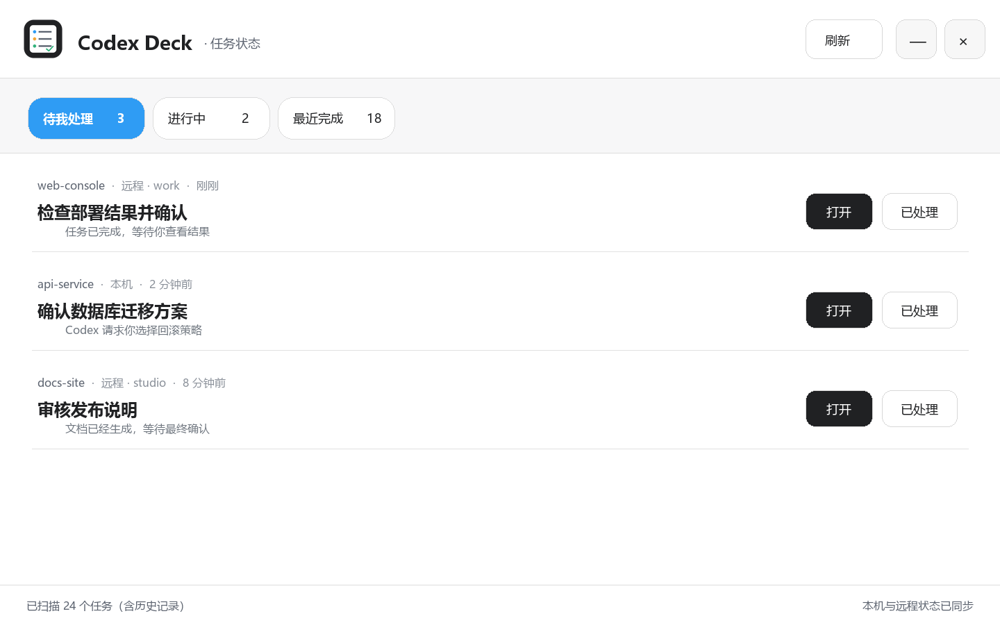
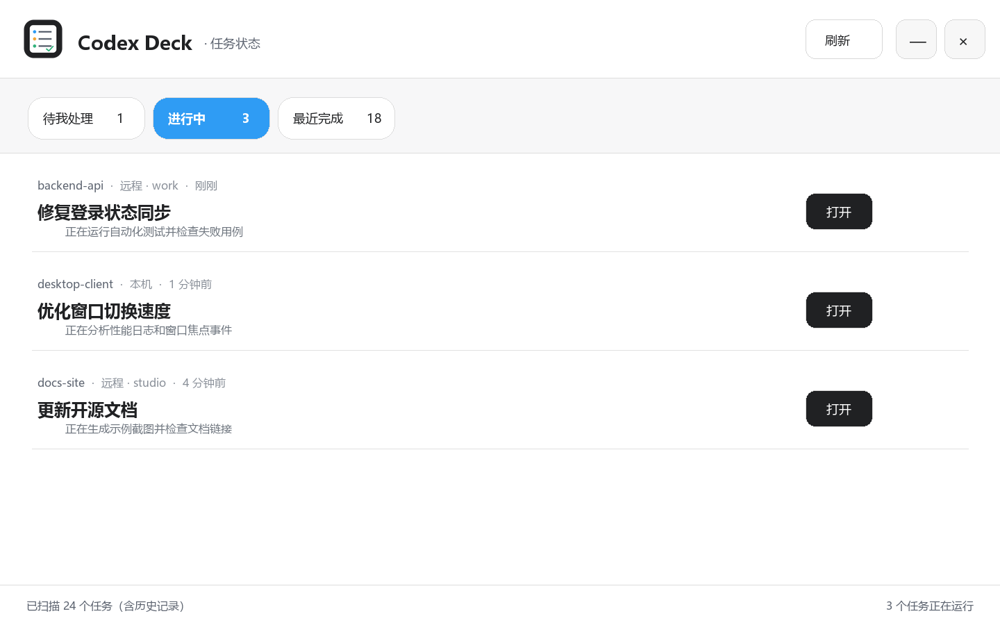

<div align="center">
  
  <h1>Codex Deck</h1>
  <p><strong>A native Windows task inbox for Codex Desktop.</strong></p>
  <p>Track local and remote tasks, review completed work, and jump back into the right conversation.</p>
  <p><a href="README.zh-CN.md">简体中文</a></p>
  <p>
    <a href="https://github.com/dlsaint/codex-deck/actions/workflows/build.yml"></a>
    <a href="LICENSE"></a>
    
    
  </p>
</div>



> The demo uses synthetic projects and task text. No real conversation data is included.

Codex Deck turns scattered Codex sessions into a small human-in-the-loop workflow: what is still running, what needs your attention, and what you have already reviewed.

## Why Codex Deck?

- **Review inbox** — finished tasks remain in **Needs attention** until you explicitly mark them handled.
- **Local and remote tasks** — one view for local sessions and Codex-managed SSH projects.
- **Side-conversation awareness** — tracks side tasks and returns to the matching parent conversation when possible.
- **Fast task navigation** — opens Codex and targets the relevant conversation instead of acting as a passive status widget.
- **Native and lightweight** — WPF + .NET Framework, with no Electron, WebView, account system or project telemetry.
- **Event-first updates** — desktop IPC and lifecycle events provide fast status changes, with bounded polling only as a fallback.

## Workflow



## Screenshots

| Needs attention | Running |
| --- | --- |
|  |  |

## Project focus

| Capability | Codex Deck | Status-only overlay |
| --- | :---: | :---: |
| Running task visibility | ✅ | ✅ |
| Explicit review inbox | ✅ | Usually not |
| Manual “handled” acknowledgement | ✅ | Usually not |
| Local and managed remote sessions | ✅ | Varies |
| Side-conversation navigation | ✅ | Usually not |
| Token and billing dashboard | Not a goal | Often supported |

Codex Deck intentionally focuses on task handoff and review rather than token accounting.

## Requirements

- Windows 10 or Windows 11
- Codex Desktop with at least one local session
- Windows OpenSSH Client for managed remote projects

## Build from source

```powershell
git clone git@github.com:dlsaint/codex-deck.git
cd codex-deck
powershell -ExecutionPolicy Bypass -File .\build.ps1
.\dist\CodexProjectCenter.exe
```

Create a desktop shortcut:

```powershell
powershell -ExecutionPolicy Bypass -File .\install-shortcut.ps1
```

## Headless diagnostics

```powershell
.\dist\CodexProjectCenter.exe --self-test .\dist\self-test.json
.\dist\CodexProjectCenter.exe --cache-merge-test .\dist\cache-merge-test.json
.\dist\CodexProjectCenter.exe --title-sync-test .\dist\title-sync-test.json
.\dist\CodexProjectCenter.exe --navigation-event-test .\dist\navigation-event-test.json
```

Performance diagnostics are stored in `%LOCALAPPDATA%\CodexProjectCenter\project-center.log`. Search for `[PERF]` to find threshold-based timing and resource records.

## Compatibility notes

Codex Deck reads local session records, Codex Desktop state and logs, and uses local named-pipe IPC, OpenSSH and limited UI Automation. Some of these structures are implementation details rather than stable public APIs, so a Codex Desktop update may require a compatibility update here.

## Privacy

- No telemetry, analytics, advertising or project-operated cloud service.
- Task titles, status, working directories and short previews are processed locally.
- Remote task discovery uses the machine's existing SSH and Codex configuration.
- See [PRIVACY.md](PRIVACY.md) and [SECURITY.md](SECURITY.md).

## Roadmap

- [ ] Signed, downloadable Windows releases
- [ ] Automatic update checks
- [ ] Configurable local notifications and sounds
- [ ] English application UI
- [ ] Additional navigation paths as Codex exposes stable APIs
- [ ] Modularize the current single-file prototype for easier contributions

## Contributing

See [CONTRIBUTING.md](CONTRIBUTING.md). Do not attach raw session logs or screenshots containing private task text to public issues.

Release maintainers can use the tag-driven process in [RELEASING.md](RELEASING.md).

## Disclaimer

Codex Deck is an unofficial community project and is not affiliated with, sponsored by, or endorsed by OpenAI. Codex, ChatGPT and OpenAI are trademarks of their respective owners.

## License

[MIT](LICENSE)
