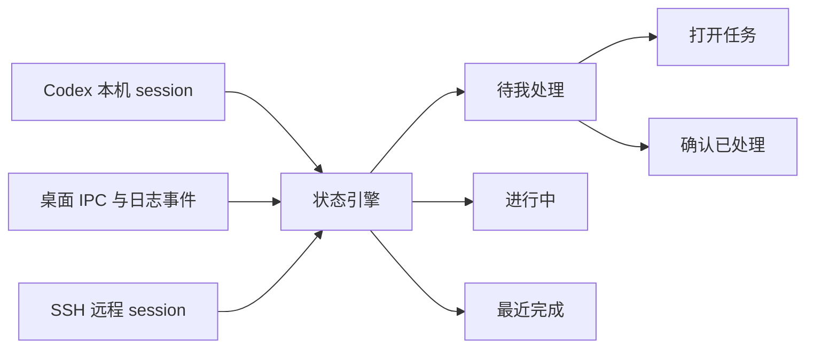

<div align="center">
  
  <h1>Codex Deck</h1>
  <p><strong>Codex 任务台——面向 Windows 的原生任务收件箱。</strong></p>
  <p>统一查看本机与远程任务，确认已完成工作，并快速返回对应会话。</p>
  <p><a href="README.md">English</a></p>
  <p>
    <a href="https://github.com/dlsaint/codex-deck/actions/workflows/build.yml"></a>
    <a href="LICENSE"></a>
    
    
  </p>
</div>


> 演示使用虚构项目和任务文本，不包含任何真实会话数据。

Codex Deck 把分散的 Codex 会话整理成一个 human-in-the-loop 工作流：哪些仍在运行、哪些需要你查看、哪些已经确认处理。

## 为什么做 Codex Deck？

- **待处理收件箱**：任务完成后仍保留在“待我处理”，直到你明确点击“已处理”。
- **本机与远程统一展示**：集中查看本机 session 和 Codex 托管 SSH 项目。
- **识别侧边任务**：记录侧边任务，并尽可能打开对应父任务和标签。
- **快速返回任务**：不仅显示状态，还负责把用户带回正确的 Codex 会话。
- **原生轻量**：WPF + .NET Framework，无 Electron、WebView、账户系统或项目遥测。
- **事件优先**：优先使用桌面 IPC 和生命周期事件，仅用有限轮询兜底。

## 工作流程



## 界面预览

| 待我处理 | 进行中 |
| --- | --- |
|  |  |

## 产品侧重点

| 能力 | Codex Deck | 普通状态浮窗 |
| --- | :---: | :---: |
| 查看进行中任务 | ✅ | ✅ |
| 明确的待处理收件箱 | ✅ | 通常没有 |
| 手动确认“已处理” | ✅ | 通常没有 |
| 本机和托管远程任务 | ✅ | 视项目而定 |
| 侧边任务导航 | ✅ | 通常没有 |
| Token/费用统计 | 非目标 | 经常支持 |

Codex Deck 专注任务交接与确认，不把自己定位为 Token 或账单看板。

## 环境要求

- Windows 10 或 Windows 11
- Codex Desktop 已生成至少一个本机 session
- 使用远程项目时，需要安装 Windows OpenSSH Client

## 从源码构建

```powershell
git clone git@github.com:dlsaint/codex-deck.git
cd codex-deck
powershell -ExecutionPolicy Bypass -File .\build.ps1
.\dist\CodexProjectCenter.exe
```

创建桌面快捷方式：

```powershell
powershell -ExecutionPolicy Bypass -File .\install-shortcut.ps1
```

## 后台诊断

```powershell
.\dist\CodexProjectCenter.exe --self-test .\dist\self-test.json
.\dist\CodexProjectCenter.exe --cache-merge-test .\dist\cache-merge-test.json
.\dist\CodexProjectCenter.exe --title-sync-test .\dist\title-sync-test.json
.\dist\CodexProjectCenter.exe --navigation-event-test .\dist\navigation-event-test.json
```

性能诊断位于 `%LOCALAPPDATA%\CodexProjectCenter\project-center.log`，搜索 `[PERF]` 可查看超过阈值的耗时与资源记录。

## 兼容性说明

项目会读取 Codex 本地 session、桌面状态和日志，并使用本地命名管道 IPC、OpenSSH 和有限的 UI Automation。部分结构不是稳定公开 API，Codex Desktop 更新后可能需要同步适配。

## 隐私

- 不包含遥测、分析、广告或项目自建云服务。
- 任务标题、状态、工作目录和短预览只在本机处理。
- 远程任务读取使用当前电脑已有的 SSH 和 Codex 配置。
- 详细说明见 [PRIVACY.md](PRIVACY.md) 和 [SECURITY.md](SECURITY.md)。

## 路线图

- [ ] 签名并提供可下载的 Windows Release
- [ ] 自动检查更新
- [ ] 可配置的本机通知与声音
- [ ] 英文应用界面
- [ ] Codex 提供稳定导航接口后减少 UI Automation
- [ ] 将当前单文件原型拆分为更易贡献的模块

## 参与贡献

参见 [CONTRIBUTING.md](CONTRIBUTING.md)。请勿在公开 Issue 中上传包含真实任务正文的 session 日志或截图。

维护者发布版本时可使用 [RELEASING.md](RELEASING.md) 中的标签发布流程。

## 声明

本项目是非官方社区项目，与 OpenAI 无隶属、赞助或认可关系。Codex、ChatGPT 和 OpenAI 是其各自权利人的商标。

## License

[MIT](LICENSE)
